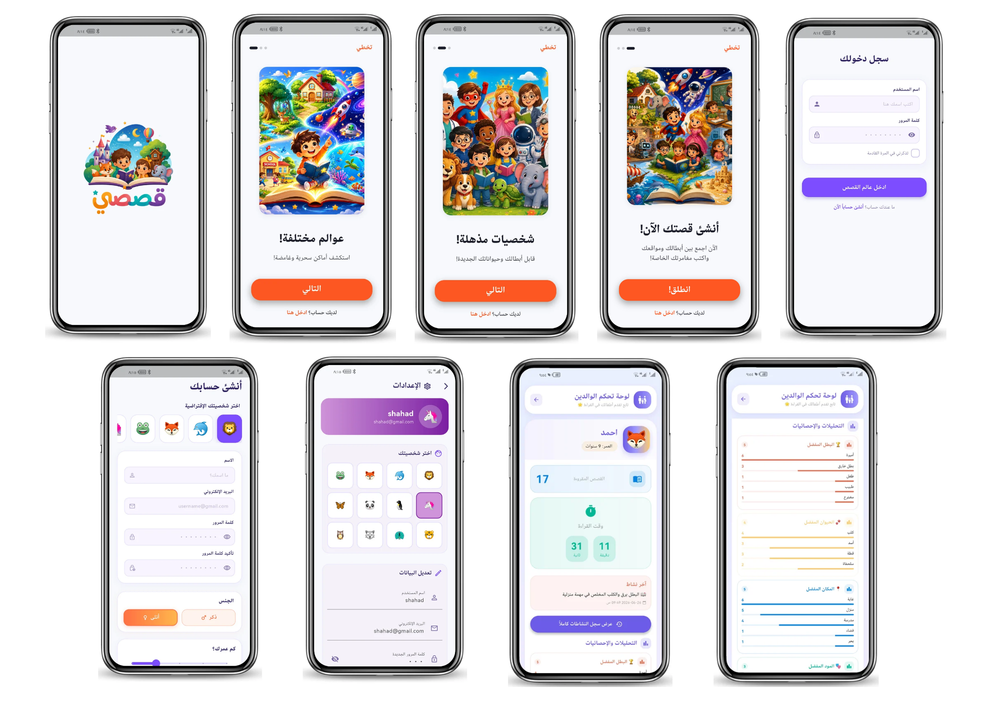
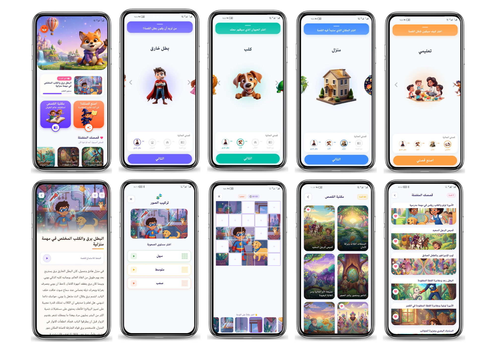
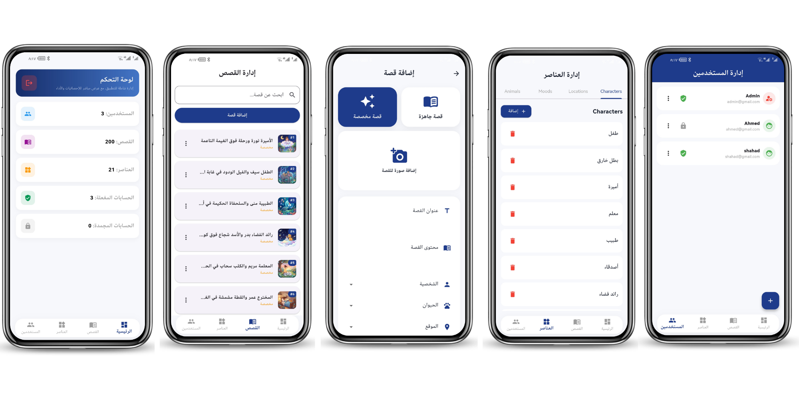
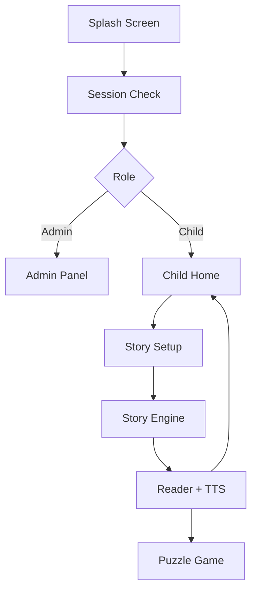
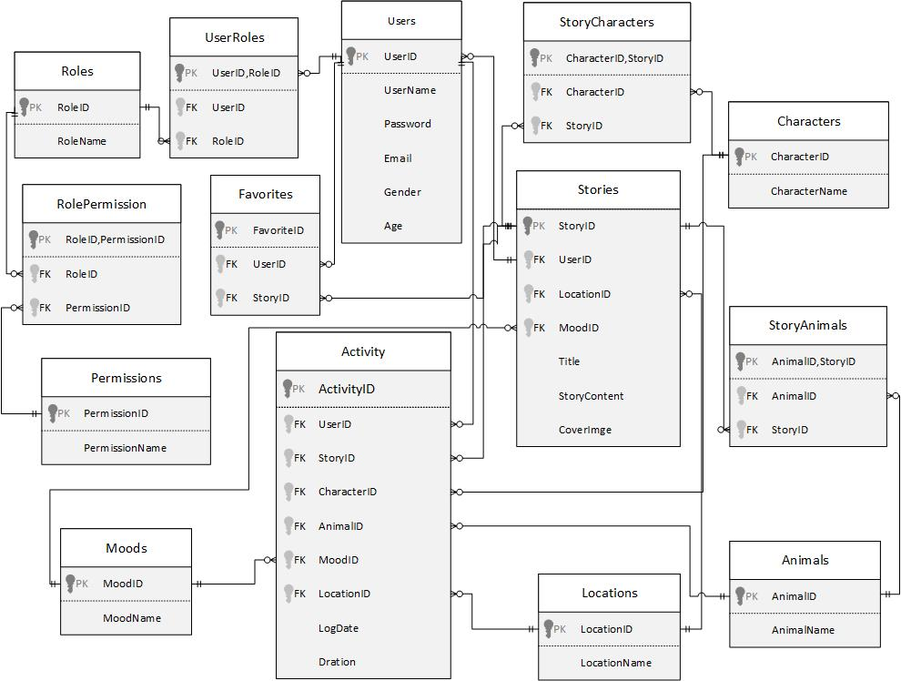

# 📖 Qisasi — Interactive & Privacy-Focused Storytelling Platform

[](https://flutter.dev)
[](https://dart.dev)
[](https://www.sqlite.org)
[](https://opensource.org/licenses/MIT)
[](#-why-qisasi-key-highlights)

**Qisasi** is an interactive, offline-first storytelling and educational platform tailored for children aged **6–10**. Built with safety, performance, and privacy at its core, Qisasi combines personalized story recommendations, synchronized Text-to-Speech (TTS) narration, and post-reading educational games without relying on cloud services.

---

## 📑 Table of Contents

* [Why Qisasi?](#-why-qisasi-key-highlights)
* [Application Interface & Visual Overview](#-application-interface--visual-overview)
* [Application Data Flow](#-application-data-flow)
* [Weighted Rule-Based Inference Engine](#-weighted-rule-based-inference-engine)
* [Database Architecture](#-database-architecture)
* [Tech Stack](#-tech-stack)
* [Team & Core Contributions](#-team--core-contributions)
* [Getting Started](#-getting-started)
* [Future Improvements](#-future-improvements)
* [License](#-license)

---

## 🌟 Why Qisasi? (Key Highlights)

* **🛡️ 100% Privacy & Offline-First:** No data leaves the device. Everything runs locally using a lightweight inference engine and local SQLite storage.
* **🎯 Weighted Recommendation Engine:** Tailors story content instantly based on dynamic child preferences (character, companion, location, mood).
* **🎙️ Synchronized TTS Narration:** Real-time text-to-speech tracking to boost reading comprehension.
* **🧩 Adaptive Puzzle Games:** Reinforces learning post-reading with 3x3, 4x4, and 5x5 interactive sliding puzzles.
* **👨‍👩‍👧 Parent & Admin Dashboard:** Role-Based Access Control (RBAC) allowing parents to monitor local reading logs and admins to control system content.
* **🌍 Full Arabic RTL Support:** Native Right-to-Left design tailored for Arabic-speaking children.

---

## 📱 Application Interface & Visual Overview

### 1. User Onboarding & Parental Controls
Presents the initial orientation journey, secure account creation, credentials validation, and the analytical parent portal designed for tracking children's reading milestones and performance statistics.



---

### 2. Interactive Story Engine, Reader & Gamification
Demonstrates the end-to-end interactive story ecosystem:
* Step-by-step customization wizard (configuring Lead Hero, Companion Animal, Setting Environment, and Story Tone)
* Dynamically generated story playback with synchronized real-time Text-to-Speech (TTS)
* Post-reading cognitive sliding puzzle with celebratory completion mechanics
* Comprehensive story library along with reading history archives



---

### 3. Administrative Control Center
Showcases the system administration portal structured for complete application oversight:
* User governance and Role-Based Access Control (RBAC) (managing child account statuses, freezing/reactivation)
* System asset management for characters, animals, settings, and narrative moods
* Dynamic content creation pipelines and story catalog management



---

## 🔄 Application Data Flow

The system guides the user through an integrated sequence, originating at session authentication and concluding with interactive post-reading activities.



---

## 🧠 Weighted Rule-Based Inference Engine

The intelligence behind Qisasi relies on a local, deterministic rule-based engine (`StoryEngine`). It eliminates cloud latency, cost, and privacy concerns while offering fast recommendation scoring.

### Matching Weights Matrix

$$Score = w_{\text{mood}} + w_{\text{character}} + w_{\text{location}} + w_{\text{animal}}$$

| Attribute | Weight Value | Description |
| --- | --- | --- |
| **Mood / Category** | **5** | Primary narrative direction |
| **Character** | **3** | Lead protagonist matching |
| **Location** | **3** | Story setting/environment |
| **Animal Companion** | **2** | Supporting character |

> **Example Evaluation:**
> A story matching **Mood (+5)** + **Location (+3)** + **Animal (+2)** achieves a total score of **10**. The story (or set of tied stories) with the highest score is retrieved. In case of a tie, the engine applies fair random selection to keep content fresh.

---

## 💾 Database Architecture

Qisasi relies on a fully local SQLite database designed around relational principles and foreign key constraints, ensuring data consistency, maintainability, and offline reliability. The database consists of **14 interconnected tables**, grouped into three functional modules:

### 🧩 Functional Modules Breakdown

1. **User Management & Security Module (RBAC):**
* `Users`, `Roles`, `UserRoles`, `Permissions`, `RolePermission`
* Manages local identity verification, role assignment, and access control for Children, Parents, and Admins.


2. **Story Content & Customization Module:**
* `Stories`, `Characters`, `Animals`, `Locations`, `Moods`, `StoryCharacters`, `StoryAnimals`
* Stores dynamic story elements, relational tags, and pre-seeded narrative content.


3. **User Activity & Engagement Module:**
* `Activity`, `Favorites`
* Tracks offline reading progress, session duration (in local device time), used parameters, and bookmarked stories.


---

### 📐 Entity Relationship Diagram (ERD)



---

## ⚙️ Tech Stack

| Domain | Technology |
| --- | --- |
| **Frontend / App Framework** | [Flutter](https://flutter.dev) (Android & Windows) |
| **Programming Language** | [Dart](https://dart.dev) |
| **Local Database** | [SQLite](https://www.sqlite.org/) via [`sqflite`](https://pub.dev/packages/sqflite) |
| **Audio & TTS** | [`flutter_tts`](https://pub.dev/packages/flutter_tts) |
| **Session Persistence** | [`shared_preferences`](https://pub.dev/packages/shared_preferences) |
| **UI/UX Design** | Material Design 3 (Full RTL Support) |

---

## 👥 Team & Contributions

This project was developed as a collaborative graduation project. Below is the breakdown of my core technical contributions to the platform as the Core & System Founder:

🛠️ **My Contributions**

* **Core System & Architecture Setup:**
Established the foundational architecture of the Flutter application, defining a scalable folder structure (Models, Screens, Services) and setting up the core project framework.
* **Database Design, Engineering & Seeding:**
Designed and implemented the full local relational database schema using SQLite (`sqflite`). Engineered the 14 interconnected tables, relationships, and foreign key constraints. Developed the automated Database Seeding pipeline responsible for pre-populating 160 customized stories, 40 ready-made stories, and system entities/assets entirely offline.
* **Authentication & Role-Based Identity System:**
Built the initial application flow starting from the **Splash Screen** (session verification) and **Onboarding Experience**, down to **Login** and **Sign Up** workflows. Implemented Role-Based Access Control (RBAC) routing for Children, Parents, and Administrators.
* **User Settings Screen:**
Designed and implemented the **Settings Screen**, allowing users to manage their profile information and logout.
* **Educational Sliding Puzzle Game:**
Designed and built the interactive post-reading **Sliding Puzzle Game** feature. Implemented adaptive difficulty algorithms (3x3, 4x4, 5x5), piece-matching logic with visual and haptic feedback, hint mechanics, and a completion celebration state (confetti animation) to reinforce learning after reading.

---

## 🚀 Getting Started

### Prerequisites

* Flutter SDK (v3.0.0 or higher)
* Dart SDK
* Android Studio / VS Code

### Installation & Run

```bash
# 1. Clone the repository
git clone [https://github.com/RzanBash/Qisasi-Interactive-Kids-App.git](https://github.com/RzanBash/Qisasi-Interactive-Kids-App.git)

# 2. Navigate to project directory
cd Qisasi-Interactive-Kids-App

# 3. Fetch dependencies
flutter pub get

# 4. Run the application
flutter run

```

---

## 🔮 Future Improvements

* 🔄 Cross-device local synchronization.
* 🤖 On-device LLM generation for dynamic story creation.
* 🎙️ Voice-assisted story customization.
* 🏆 Achievement badges and offline gamification rewards.
* 📊 Advanced learning analytics for parents.

---

## 📜 License

Distributed under the **MIT License**. See `LICENSE` for more details.

```
